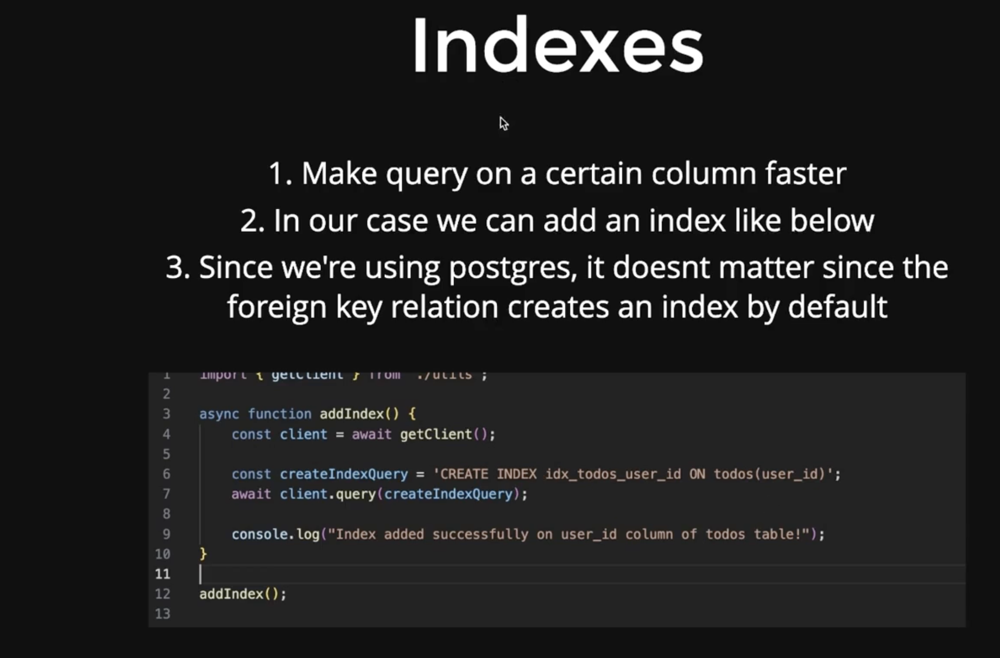
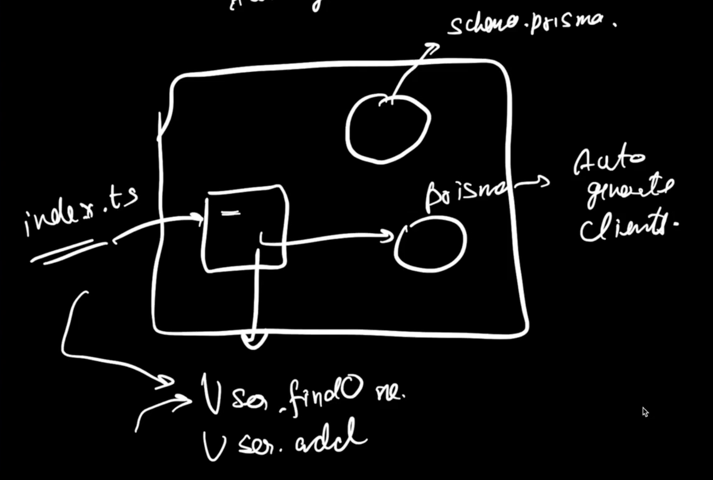

# Lec 01

## Types of DB

- 
- Connecting to postgres
  
- Basic types of queries
  
- Let's start
  
- 
- 
  
- `psql` cli for postgres
  
  
- Run the scripts
  
- 
- To avoid SQL Injection we are using the template variable in Raw SQL queries
  
  
  
  
  
  
- Joins
  
  
- LEFT JOIN everything from the left table
- 
- Problems with writting raw queries
  
-

## Types of ORM

- Prisma, Drizzle

## Prisma

### Introduction

- Prisma keeps track of all the migrations happen in the app and gives you automatic migration
- Database migration, also known as schema migration, is the process of moving data from one database to another, while modifying the structure of the objects in the database.
- Postgres connection string
  
- Rows in SQL are not always printed sequentially
  

### npm vs npx

- npm: it is a manager, npx: it is a package executable

### Prisma Migrations

- After running `npx prisma migrate dev --name Initialize the schema` prisma does two things for us
  - Create tables in db along with a \_prisma_migrations table where prisma keeps all log of migrations happened
  - Create migration.sql
- Schema Migration vs Data Migration
- if we install locally
  `npx prisma init`
  `npx tsc —init`
  if we install globaly `tsc -= init`

### Generating the prisma client

- What is a client?
  - Based on the db schema corresponding JS object files are created on which we can perform some actions.
    
- What is a auto generated client?
  - The process of converting the schema.prisma into the client is what called the auto generated client.
- When we run `npx prisma generate` then prisma generates clients, these clients can we used in the app and under the hood these clients perform the SQL queries for us.
  
- Anytime you change your prisma schema you gotta have to do two things:
  - Migrate
  - Generate clients
