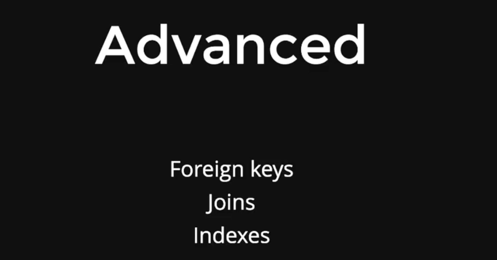

# Lec 01

## Types of DB

- 
- Connecting to postgres
  
- Basic types of queries
  
- Let's start
  
- 
- 
  
- `psql` cli for postgres
  
  
- Run the scripts
  
- 
- To avoid SQL Injection we are using the template variable in Raw SQL queries
  
  
  
  
  
  
- Joins
  
  
- LEFT JOIN everything from the left table
- 
- Problems with writting raw queries
  
-
