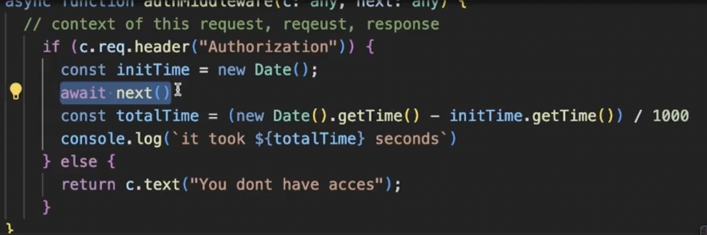

## Serverless

- In serverless you pay per request basis
- Famous serverless providers:
  - AWS Lambda
  - Google Cloud Functions
  - Cloudflare Workers
- What can you make using Cloudflare workers
  
- Cloudflare is

### Cold start problem

- Two solution:
  - Ping server in certain amount of time
  - Create a warm pool (make atleast one server up even if no request comes for a while)

### Creating routes in Cloudflare worker

- 
- wrangler is `cli` for cloudflare that lets you do bunch of things with cloudflare one of the thing is push/ pull code to cloudflare
  - `npx wrangler login`
  - `npx wrangler whoami`
  - `npm run deploy` or `npx wrangler deploy`
- To change the worker name you have to change it in `wrangler.toml`
- To add custom domain in worker either buy domain on cloudflare or transfer domain here.
- We can't use express with cloudflare workers because it is heavily depends on nodejs and cloudflare worker have their own runtime.
- You can't use socket.io in worker
- We can see the way we do routing in cloudflare workers is pretty ugly so we need something better so that we can manage routing in cloudflare workers.
- Just like express we have something called hono for the cloudflare.

### Hono Routing Engine

- `npm create hono@latest hono-app`
- Look for cloudflare workers examples
- This way you can check for the time taken by a request to complete
  
- c->context in hono: It will have all the context about the request.

### AWS Deployment

- `ssh -i test.pem ubuntu@13.234.111.39`
- `chmod 700 kirat-test-2.pem`
- `ls -ltr`
- If you are deploying React app then generally you deploy on CDN, if you're deploying NEXT js app generally you deploy on edge servers.

### Reverse Proxy

- 
- If we don't give any port in the uri then the default port is 80

### Changing the IP of website to point locally

- `sudo vi /etc/hosts`
  
- Using this if you go to eg. google.com it will point it to the local ip that you have provided for the machine.
- If you want to make the node process run even after we close the terminal use. It will make the process run forever
  - `прm і -g pm2`
  - `pm2 start index.js`

### Nginx

- nginx rtmp module for streaming
