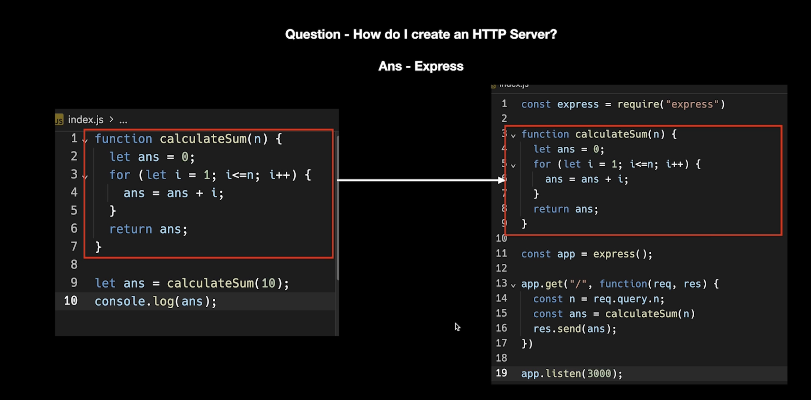
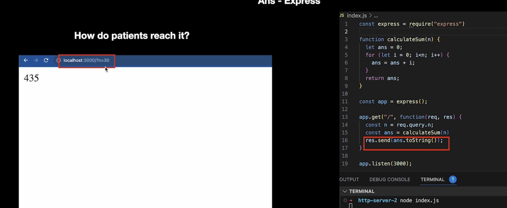
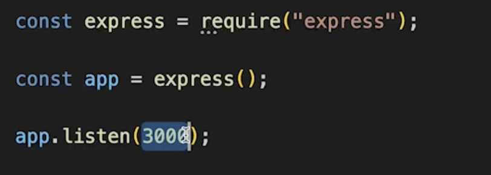
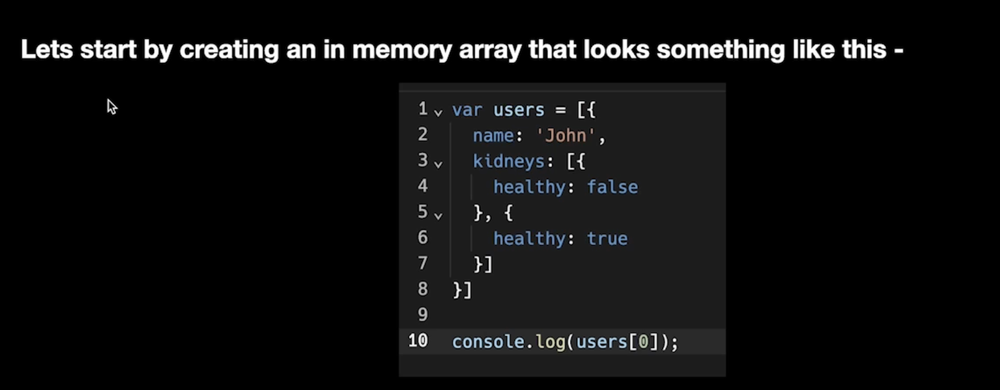
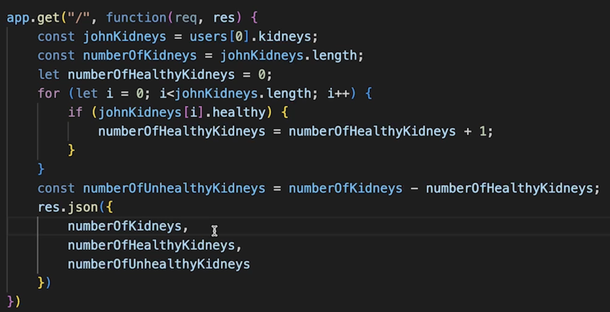

# Express and HTTP with real world examples Postman

- HTTP is a protocol you can write it in any language of your choice.

## Example of single threaded

- Doctors are single threaded, they check one patient at a time.
- Your logic is like doctor
- But what if you want to expose this logic to the world?
  This is where HTTP (Hyper Text Transfer Protocol: This lets you transfer your data from one computer to another ) comes into the picture
  It lets you create a ~hostpital where people can
  Come and find you
- Question - How do I create an HTTP Server?
  Ans - Express
  
- Express is a library that let's you create a HTTP server.
  
  
  

- Whatever port the HTTP server is listening on it needs to be unique for every process.
- How the user will access this code?
  

# Hospital App Backend Example

## Flow

- Creating an http server
- express
- node default library => no
  

- Try `ifconfig` in terminal

## Sending data to server

- Query parameter
- Path parameter

## In memory data

- Look for hoppscotch.io it is open source version of postman.
- Look about the middlewares, you can create your own middlewares.
- Default response code is 200
  
- If you don't write anything in require it automatically imports index

## FS Server

- path parameters
  
- Remote file getter
  

## App.use()

