# Lec 1

## DOM - Document Object Model

- 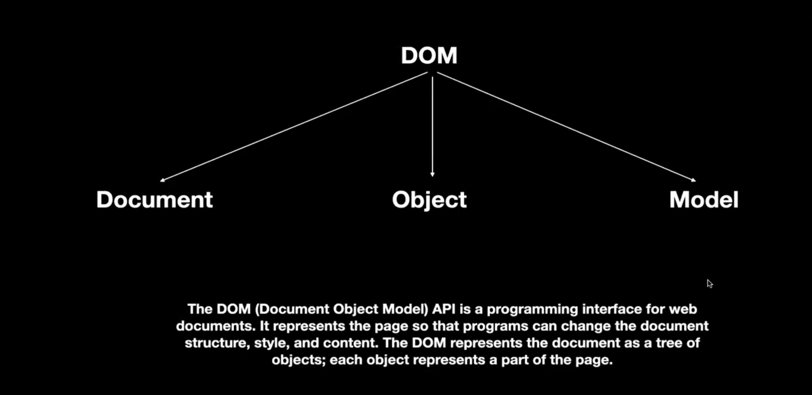
- When we get the DOM element using the available function i.e. document.getElementById() it returns the reference to the HTML rather than HTML. It is a DOM element, you can perform different operations on it.
  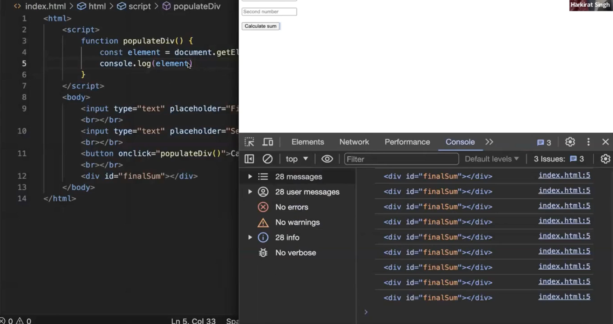
- You can change the structure of your website using the javascript. So, with HTML and JS you can create a dynamic website.
  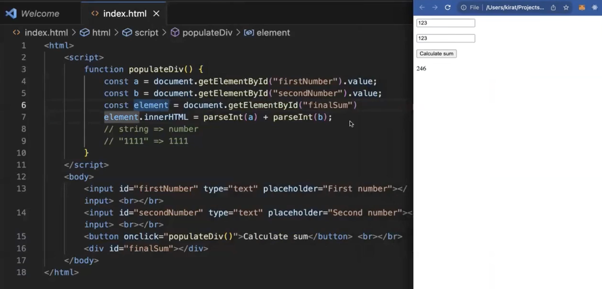
- In case of promise being returned or await need to use in function, it make function async.
- onInput attribute of input allows you to execute a function as you give input.
- Doing calculation on backend and then showing the output on frontend
  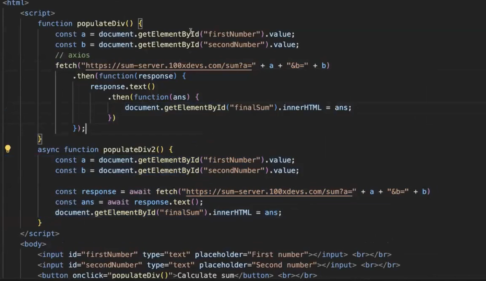
- If you would be using the axios library you will get the data as response rather than extracting the data from the response. In fetch we need to call the function specific to the data that is send by the backend because we don't know the kind of data that is being send by the server. So, fetch developers left that thing on user.
  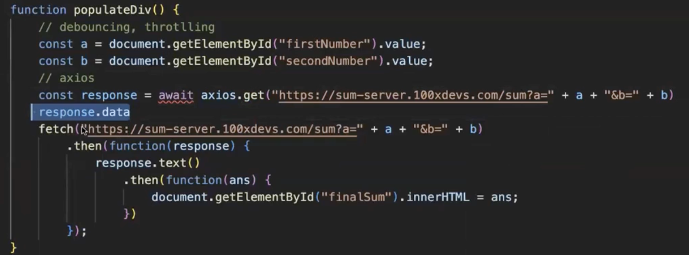
- Through refs in react you can directly manipulate the DOM objects

## Throtlling and Debouncing

- Using this you can send request when user put value either input box, and the api request will automatically will be send.
- Debouncing: You don't send out the request immediately it goes after a delay. Delay the call to a function until ive not been called for 100ms
  and I've been called atleast once.
- Debounce Logic
  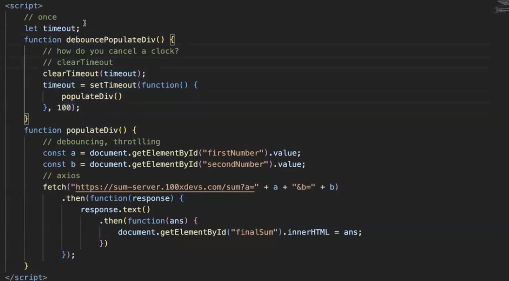
- Using Debounce you can minimize the number of backend calls and optimize your application.
- Throtlling: Your backend ignore few request and process the next request.

# Lec 2

## Why Frontend Frameworks?

- Simple todo app using vanila JS and HTML
  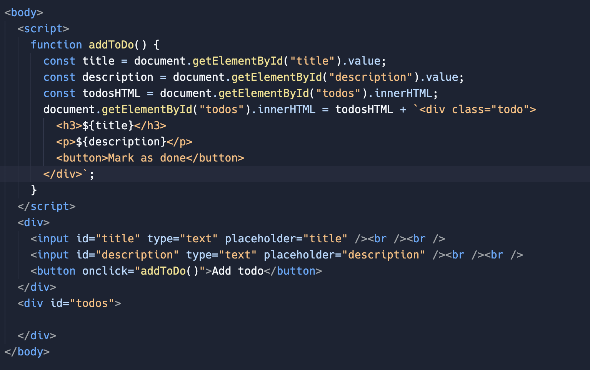
- When you do document.createElement() it create an DOM object which is not yet part of the DOM.
- Only after using appendChild function your div is added to the DOM.
  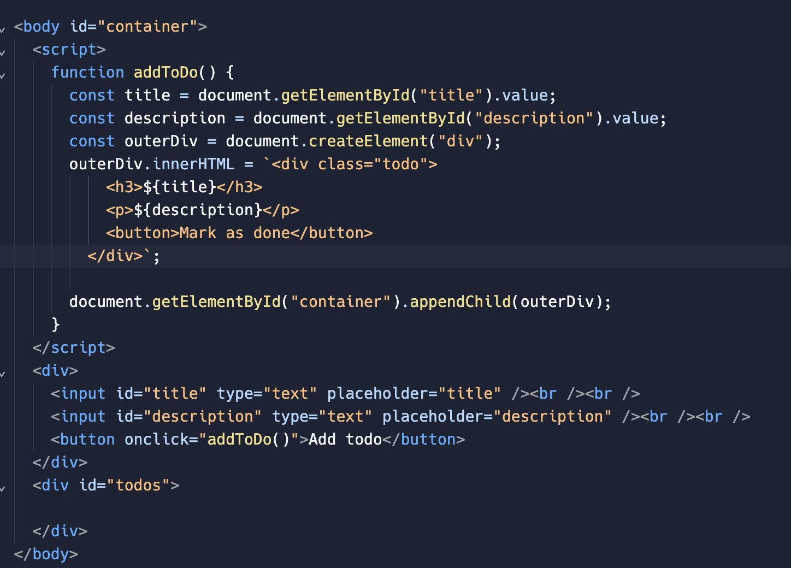
- Dynamic Todo App. This will give you an idea how react works behind the scenes.
- Creating your own reconcilers

```
    <!DOCTYPE html>
    <html>

    <head>
    <script>
        let globalId = 1;

        function markAsDone(todoId) {
        const parent = document.getElementById(todoId);
        parent.children[2].innerHTML = "Done!"
        }

        function createChild(title, description, id) {
        const child = document.createElement("div");
        const firstGrandParent = document.createElement("div");
        firstGrandParent.innerHTML = title;
        const secondGrandParent = document.createElement("div");
        secondGrandParent.innerHTML = description;
        const thirdGrandParent = document.createElement("button");
        thirdGrandParent.innerHTML = "Mark as done";
        thirdGrandParent.setAttribute("onclick", `markAsDone(${id})`);
        child.appendChild(firstGrandParent);
        child.appendChild(secondGrandParent);
        child.appendChild(thirdGrandParent)
        child.setAttribute("id", id);
        return child;
        }
        function addTodo() {
        const title = document.getElementById("title").value;
        const description = document.getElementById("description").value;
        const parent = document.getElementById("todos");

        parent.appendChild(createChild(title, description, globalId++));
        }

    </script>
    </head>

    <body>
    <input type="text" id="title" placeholder="Todo title"></input> <br /><br />
    <input type="text" id="description" placeholder="Todo description"></input> <br /><br />
    <button onclick="addTodo()">Add todo</button>

    <div id="todos">

    </div>
    </body>

    </html>
```

- Doing DOM manipulation using the primitives given by browser is difficult
- State function
  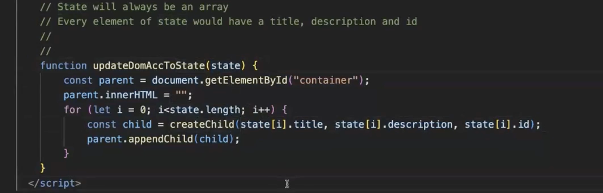
  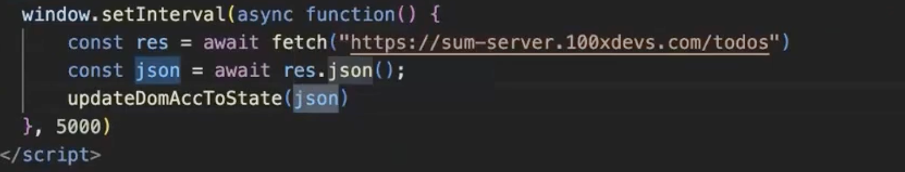

## React Foundation

- function that will be trigger the state update --> depending on it diff function will be called(react core function) --> element render function (react-router-dom)
- `npm create vite@latest` This gives you boilerplate code for react
- `npm run dev` to run your app in dev env
- Dynamic websites, when u have to create a dynamic website, you write a lot of JS code that does DOM manipulation. There is little HTML and lot of JS, JS will inject the HTML inside DOM.
- You can also use React.createElement to create JSX
  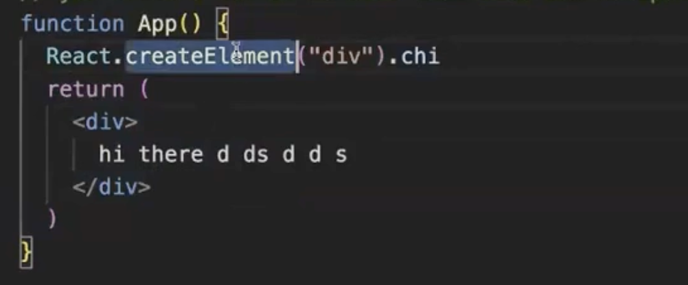
- Raw JS vs React
  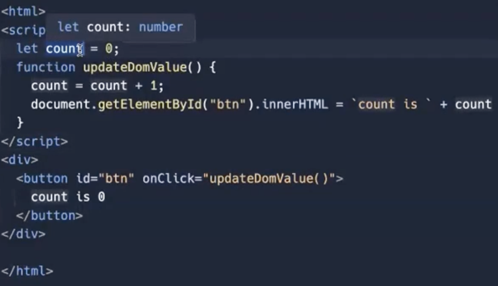
  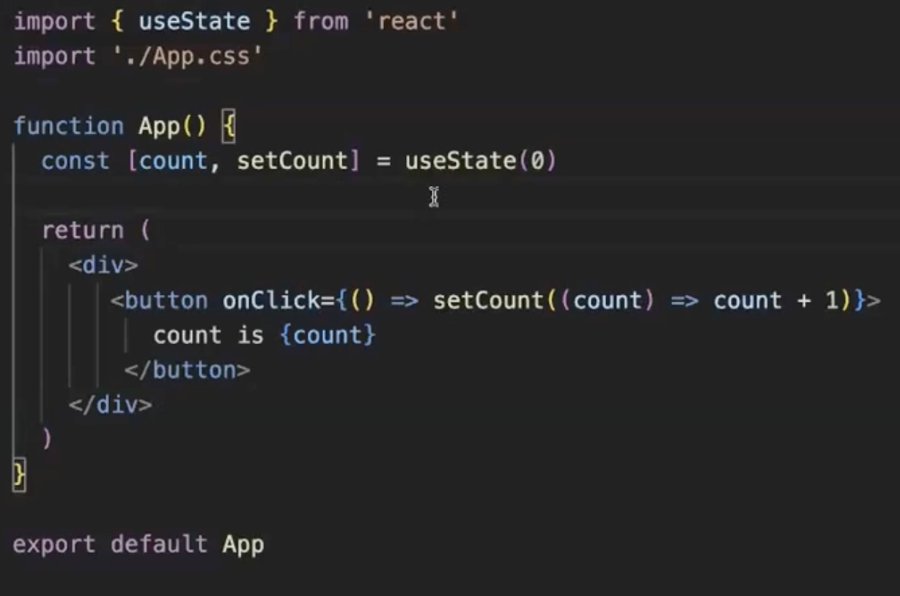
- In React state are the variables which is being carefully watched by the React, as these variables will be updated then the DOM need to be changed.
- React is what which when state update it calculates that something is need to be changed in the DOM
- ReactDOM tells the browser what to render, it has all the DOM
  browser specific functions. There is a slight delay when changes propagates from virtual DOM to real DOM.
- Read about webSockets vs http
- What is recoil in React?

## Typescript

- In typescript void is not strict type
- with void type widening happens. That is why the below code doesn't throw any error you can try the code with the number type it will throw error.
  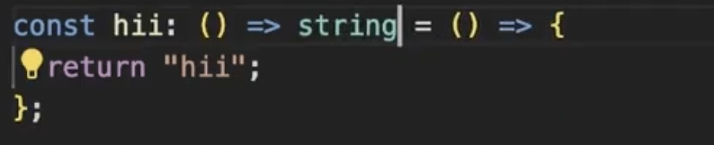
