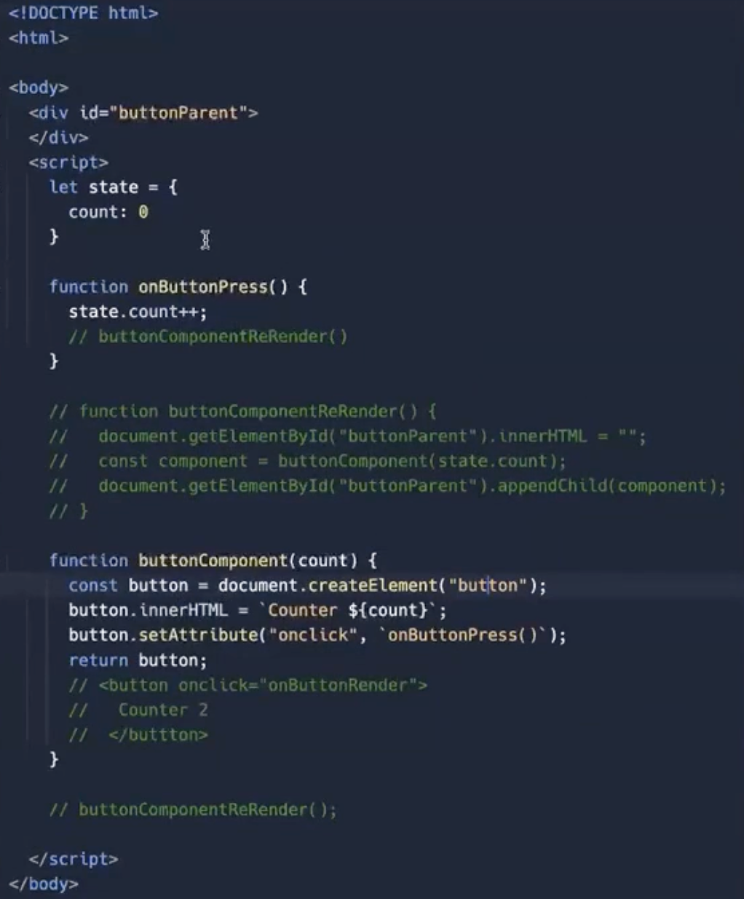

# React

## React Basic

- There are three basic things related to React:
  - Component
  - State
  - Rerendering
- 
- Use JSON.stringy() to print the JS Object on browser.
- Any time a parent re-renders all of its child re-renders as well.
- https://stackedit.io/ you can look at this website, online Md tool

- render: you can deploy your express server for free here
- vercel, netlify: you can deploy your frontend here for free
