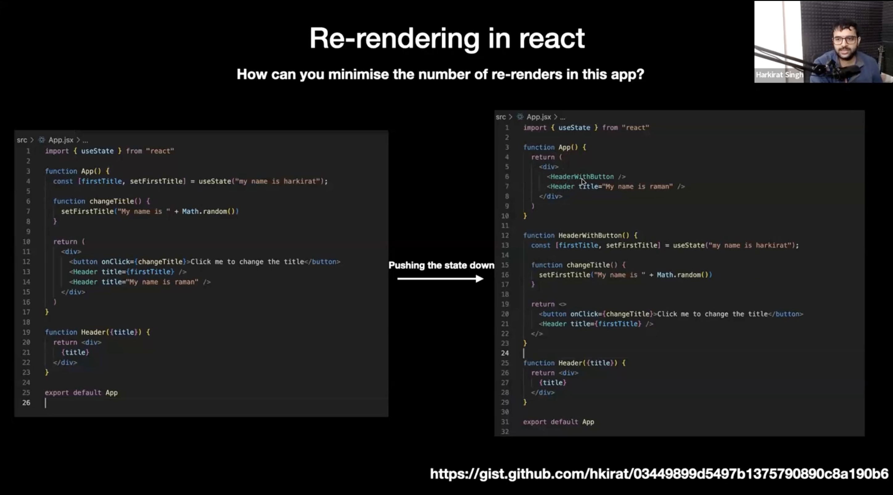
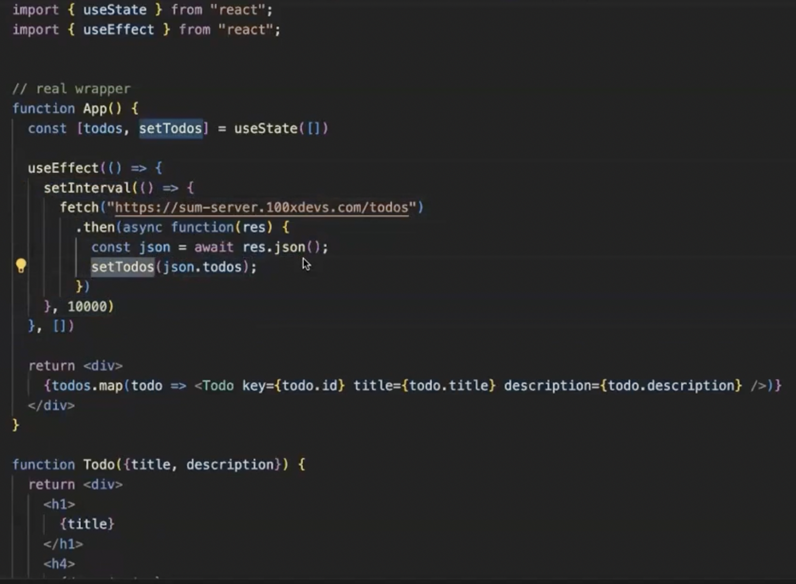

# Lec 1

## React Component Returns

- A React function returns JSX
- A component can only return a single top level xml
- Why?
  - Makes it easy to do reconciliation
  - Reconciliation: The process of figuring out what DOM updates need to happen as your application goes.
  - `<React.Fragment> == <>`
- Its a good idea that if child component need state, then it must be created inside the child component rather than in its parent, this will save your re-renders, as any change in the state of parent component will force all the child of parent to re-render. This will minimize the number of re-renders.
  
- Define state in the lowest common ancestors
  
- Another solution to avoid unnecessary re-renders is using React.memo, It tells react-dom to only re-render the element only when the props are changed.
  
  
  
  

## Wrapper Components

- Which takes other components as input
  
- Cleaner way of writing the above code. children props have all the statements that you have wrote inside the tags.
  

## React Hooks

- Anything which starts with `use` is a Hook.
  
  
- Better way
  
- If I'm keeping the code inside the fragment it is re-rendering even though it is kept inside the memo. Maybe because it is not have any parent.

## Side Effects

- Anything which is not related to rendering is known as side effect in react because these are not part of the main react life cycle.
  
- It is important because these need to be separate from your rendering cycle. This necessarily should not convoluted with the life cycle.

## Common Hooks in React

- useState: it is good enough hook if we just want to make our website dynamic without sending api calls, but if we need to make api calls we need another hook.
- useEffect: This will help you to do side effects, and it also sets conditions for doing side effects too
- Wrong way of using the useEffect, condition means on what variable you should react to watch on.
  
- You can't use useEffect like this, the top level function can't be async
  
- Better way to do async operation is using the asyncUseEffect()
  
- Problem with doing async operation with useEffect() above way is that it may create problem while fetching data, eg. state changes one request is out, and in-between of response received another request is out and the 2nd response is received first. These cases it may cause problem. This is security bug, it can be solved using asyncUseEffect().
- arrow function is useful in case of binding of 'this' variable.
- useCallback:
- useMemo: memoization means remembering some output given an input and not computing it again. It is mildly DSA concept. This hook gives a performance boost.

### 1. useCallBack

### 2. useMemo

- Use it when we have to don't perform logic if something hasn't changed and this will take the previous value rather than running l
  
- 

### 3. Custom Hook

- 
- You can only use the useState() inside a hook or component, can't be done inside a regular function.
-

### 4. State Update

- If you pass function rather than constant value you can update state more desirably like this. In the constant one the value is not updated at instant so the value is incremented only once but in case of function twice.
  
  

### useRef
- 

## memo vs useMemo

- memo is used to render component
- useMemo is for data
- PureComponent in class component is memo in function one.
