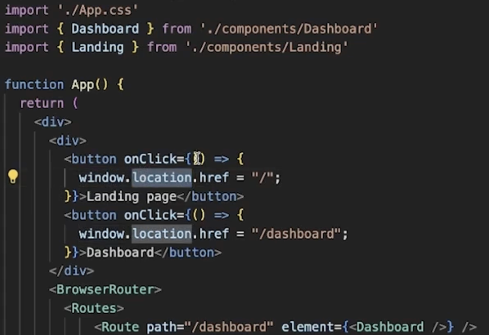

# Lec 01

## Routing

- 
- 
- 
- NextJS have file based routing
- with location.href reload happens and whole page goes through a refresh
- The above way is not a great way to do client side routing.
- The right way to do that is using the useNavigate hook
  
  
- The above way will throw error, you can only use the useNavigate hook inside the BrowserRouter
  
- Lazy Loading
  
- Make component default export
  

## Prop Drilling

- Keep passing down the props
- Problem
  - It becomes unmanageable to pass the props down
- It is anti pattern in react

## Context API

- Context API helps you to get rid of props drilling
- Three things to do while using context
  - Define a context
  - Provide the context throughout the component
  - then use the useContext hook
- Two benefit
  - Let's you to teleport the props from one component to other without passing it down the chain
  - Let's you keep all state logic outside of your core react component
- Sharing context has two things
  - Creating a context
  - Wrapping it around where we want to use it, wrap anyone that wants to use the teleported value inside a provider
- Provider: Something that provides the context value later on.
  
  
- Your state is still inside the component, context api just lets you teleport the value without using props
- reducer and useReducer hook is more efficient than context api for state management.
- If you use recoil you won't be needing any of it.
- Why do you use the context API
  - to make rendering more performant: No
  - to make syntax cleaner/ get rid of prop drilling: Yes
- To make rendering more performant and cleaner code you should use state management libraries.

## Recoil

- Any react codebase can be divided into two codebase
  - All the state logic
  - All the component logic
- State library management lets you do that and keep separation of concerns.
- Recoil is a state management library.
- It is introduced in the market 3-4 years back, it makes state management so efficient
- Atom is the smallest state
  
- The biggest advantage of using it, now you can now create your DOM tree whatever way you want. Now the state will be managed outside of the component.
  
- Now, only the component which is using the component will be re-rendered.
- Recoil, gives us three hooks to get and update the states.
  
- Components using the recoil hooks need to be wrapped by RecoilRoot
- Have a look at `react-hook-forms => formik`--> They are performant and avoid unnecessary re-renders.
- For derived state in Recoil you should use `selectors`.
- useMemo restricts the logic in the same component where as useSelector pulls that logic outside of the component and can be used as a derived unit too.

## Webhook

- Webhook lets one server directly talk to another server eg. stripe, razorpay webhook.
- Hash Routing is used for chrome extensions

## Recoil Recap

- 
  
  
- Recoil gives you access to selectors which pretty much do the same like useMemo
- Creating a selector
  
