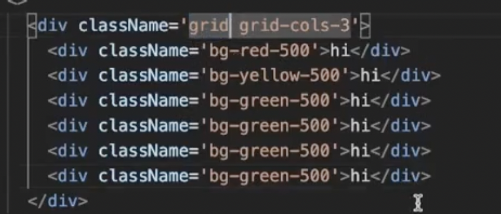
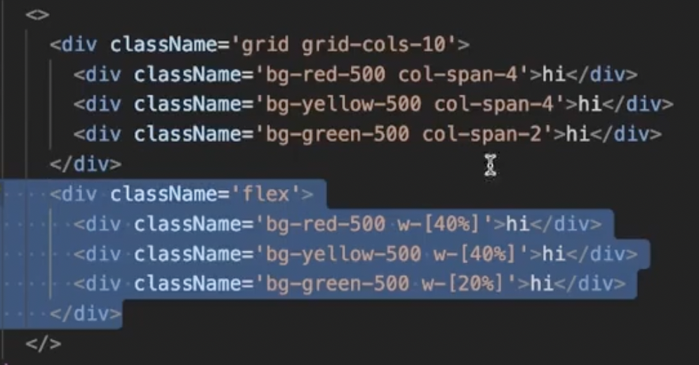
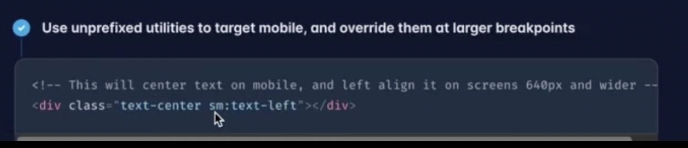

# Lec 1

## Revision

- Flex: Let's you position elements next to each other
-

## Tailwind

- Grid: equal space
  - It will divide the screen in three equal columns
    
  - It will divide the screen in 10 equal columns and two div will have 4 column width and the last one will have 2 column
    
- Tailwind is mobile first. Text will will center for all screens and for anything greater than sm the text will be left align.
  

## Storybook

- It is useful when you are exposing your components to the world. It allows you to expose your components without sharing the actual code for your components.
-

## ElectronJS

- have a look at it
