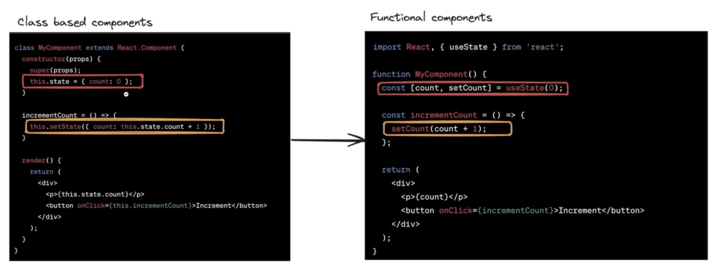
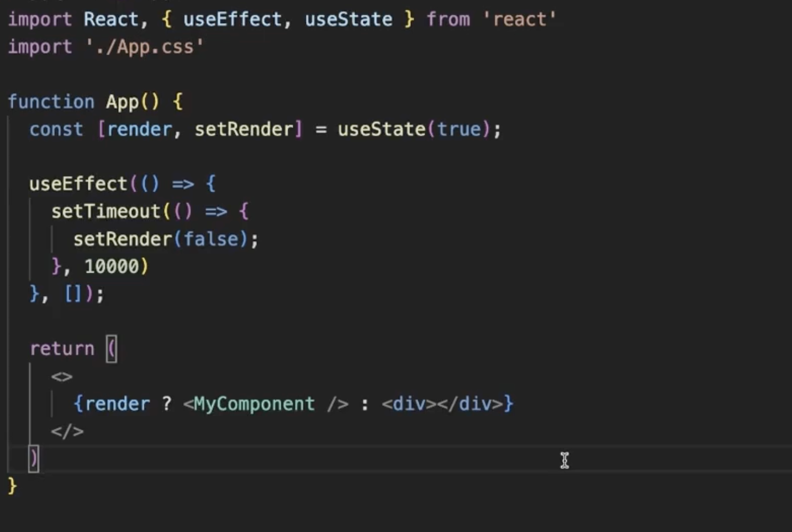
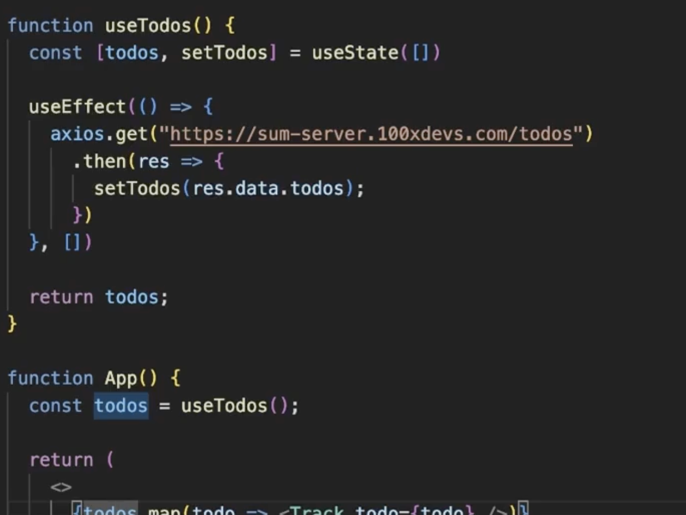
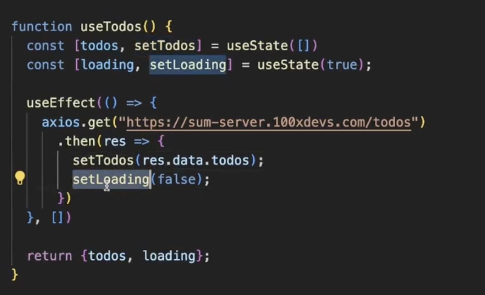
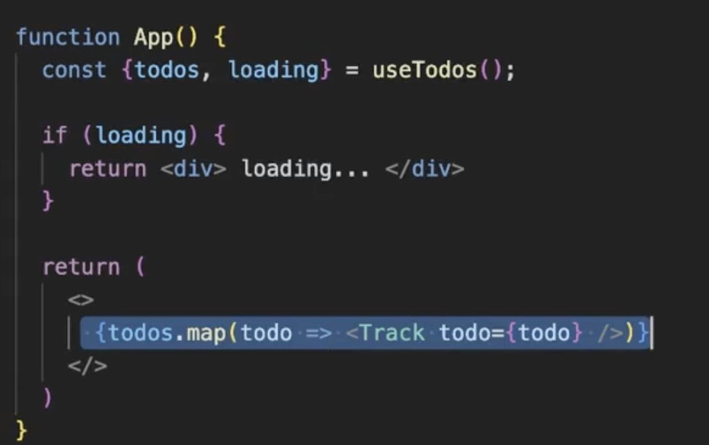

# Lec 01

## Custom Hooks

- Hooks give you access to state and lifecycle events
  
- React.StrictMode gives you some benefit when you are in dev mode, it doesn't give you any benefit when you are in production.
- You must only return a function from the `useEffect` though you can return other things from it too. So, this returned function will run when the next time state changes and first this function will run then the rest statement in the `useEffect`, mostly it is used for clean up process. If the dependency array is empty then we return the function it will affect when the component will unmount.
- Below way the component will render only for 10 sec
  
- There are two important properties:
  - Uses another hook internally (useState, useEffect, another custom hook)
  - Starts with `use`
- A custom hook
  
- Slightly better with feedback
  
  
- If a hook's value changes, the component will re-render. This is because the code inside custom hooks re-runs every time the component re-renders. For example, if you change serverUrl or roomId, the Effect will re-sync and react to your changes. You can see the change messages in the component.
- memoization using useMemo vs useEffect
  INDEPTH :-
  UseEffect runs after component get's rendered and it is asynchronous in nature, on the other hand useMemo runs before component get's rendered so we should use useMemo for memoization instead of useEffect.
  so if we use useffect for memoization component will re render again after setting state inside useEffect, we should avoid that too.
- `useDeferredValue` hook: delay the rendering of expensive rendering

## Data Fetching Hooks-Auto Refreshing

- Web sockets are popular way to do this but we can do it using the custom hook too.
- `swr` famous library which does the same things
- Data lake is used dumping your data and then do some analysis on it

## Assignment: Create a hook which will give the current width, height of the window

## Draft.js

- Look into it

## Monaco Code Editor React
