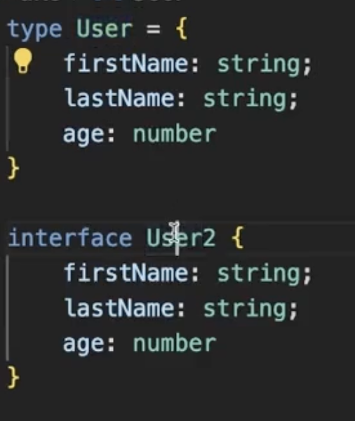
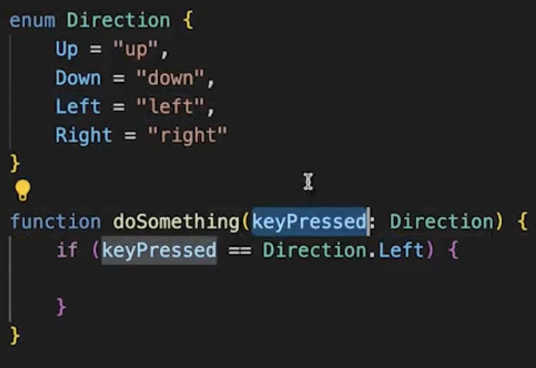
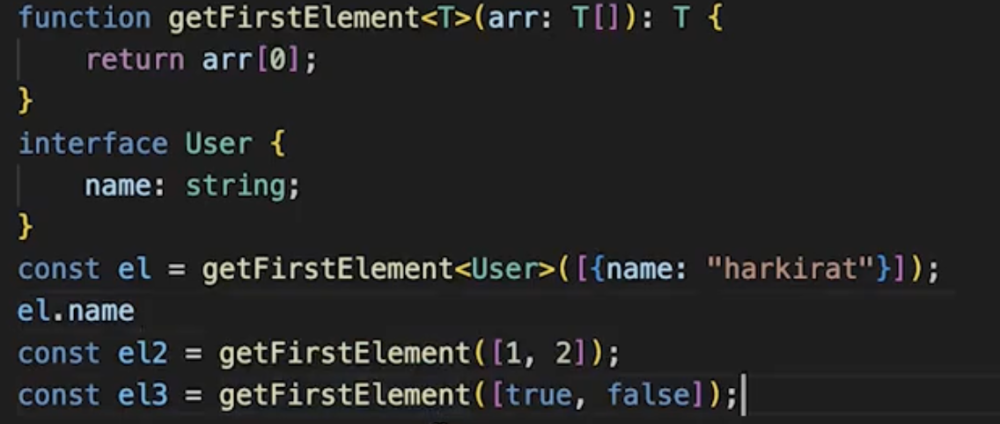

# Lec 01

## Custom Hooks

- Hooks give you access to state and lifecycle events
  
- React.StrictMode gives you some benefit when you are in dev mode, it doesn't give you any benefit when you are in production.
- You must only return a function from the `useEffect` though you can return other things from it too. So, this returned function will run when the next time state changes and first this function will run then the rest statement in the `useEffect`, mostly it is used for clean up process. If the dependency array is empty then we return the function it will affect when the component will unmount.
- Below way the component will render only for 10 sec
  
- There are two important properties:
  - Uses another hook internally (useState, useEffect, another custom hook)
  - Starts with `use`
- A custom hook
  
- Slightly better with feedback
  
  
- If a hook's value changes, the component will re-render. This is because the code inside custom hooks re-runs every time the component re-renders. For example, if you change serverUrl or roomId, the Effect will re-sync and react to your changes. You can see the change messages in the component.
- memoization using useMemo vs useEffect
  INDEPTH :-
  UseEffect runs after component get's rendered and it is asynchronous in nature, on the other hand useMemo runs before component get's rendered so we should use useMemo for memoization instead of useEffect.
  so if we use useffect for memoization component will re render again after setting state inside useEffect, we should avoid that too.
- `useDeferredValue` hook: delay the rendering of expensive rendering

## Data Fetching Hooks-Auto Refreshing

- Web sockets are popular way to do this but we can do it using the custom hook too.
- `swr` famous library which does the same things
- Data lake is used dumping your data and then do some analysis on it

## Assignment: Create a hook which will give the current width, height of the window

## Draft.js

- Look into it

## Monaco Code Editor React

# Lec 2 - Typescript

## Introduction

- Typescript is just an syntactical language which converts down to js.
- Typescript is a strictly typed language
- If you write typescript it never runs at all.
- Typescript it never run by your browser cuz it can't understand that it can understand javascript
- Typescript code is transpiled into js code by typescript compiler (tsc).
- tsc ensures there is no type error in your code.
- `tsc init` or `npx tsc --init` to initiate a tx file
- `tsconfig.json` is the config file for the ts configuration
- to convert your ts file to js file: `tsc -b`
- `use strict` is something which js makes your code little more strict

## Variables

- Type inference: If we add two numbers then the return type will also be a number.
-

## TSConfig.json

- Here you can make changes and according to that your js build will change
- You can write code in new syntax of TS and using `target` key in `tsconfig` the tsc will convert it to the older versions of ECMAScript.
- All inputs reside in `src` folder(ts) and all output `dist` or `build` folder (js) to make code maintainable.
- `rootDir: "./src"`, `outDir: "./dist"`
- The function type is supposed to return nothing as I used 'void' but it returns a string with no problems. No errors on the compiler, why?

```
type FunctionType = (arg0: string) => void;

let randomFunc: FunctionType = (name) => {
  return name.toLowerCase()
};
```

And is it the same reason here or is something else going on?

```
type Bike = {
  pedal: () => void;
}

let myBike: Bike = {
  pedal() {
    console.log('Im cycling!')
    return 4;
  }
}
```

Have a look at this: https://www.typescriptlang.org/docs/handbook/2/functions.html#function-type-expressions

- FUN TIP: If you want to only allow one login you can store the JWT Token in the DB and revoke the other one and this way only one device will keep logged in.

## Interface

- It has a multiple types clubbed together
- With interface you can create classes but types won't let you that.
- Interfaces can be implemented as a classes whereas types can't

## Types

- Very similar to `interfaces`, types lets you `aggregate` data together.
- Types and Interface are similar in sense they both lets you aggregate data
  
- You can use unions and intersection operation with the types. When you know that it will be one of the both or intersection then use type. If the property repeats then it is considered only once.
- array type is only possible with type not with the interface.
- `type a = interface a | interface b` allowed

## Turborepo

## Enums

- 
- You can also access these enums using 0,1,2,3,..

## Generics

- 
