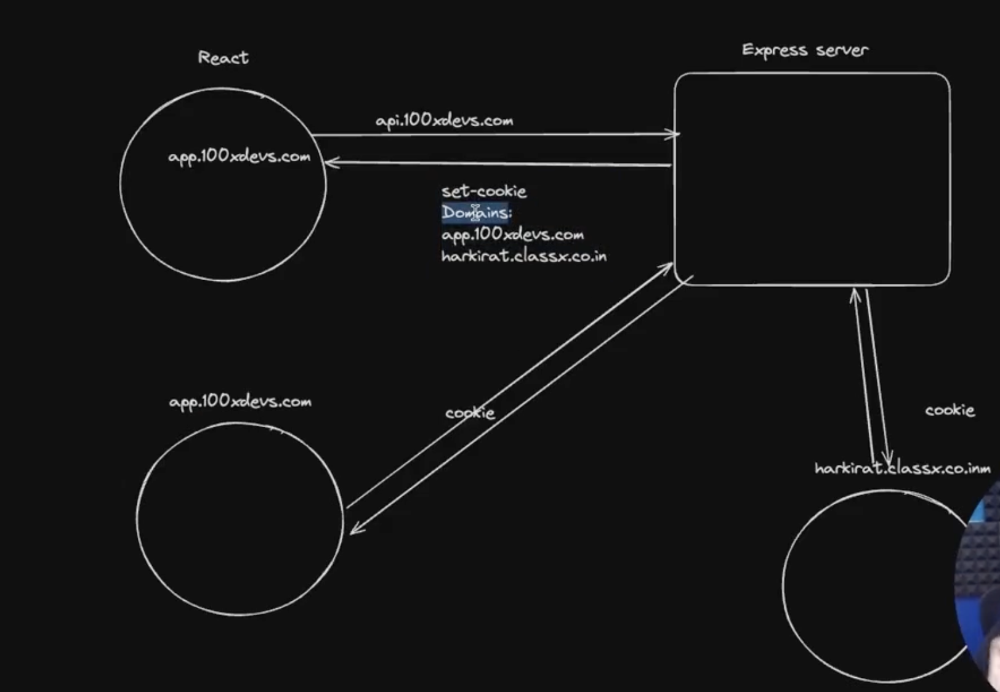
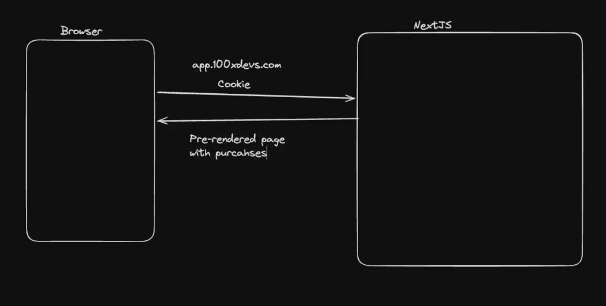
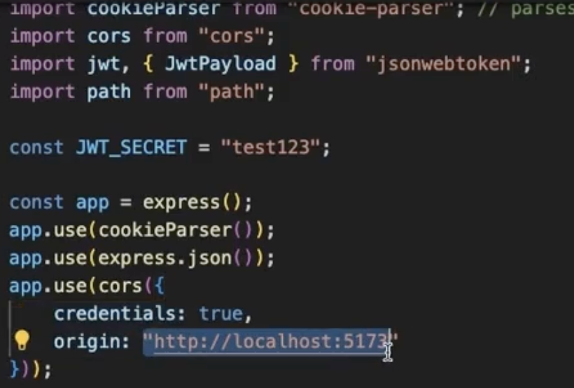
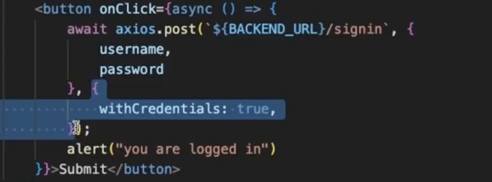
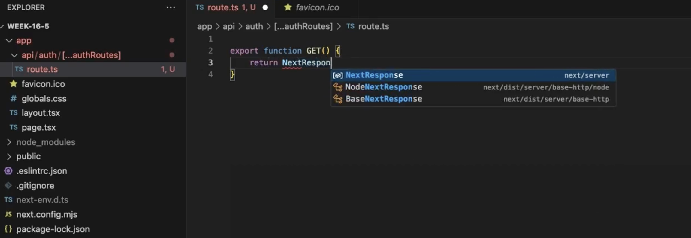
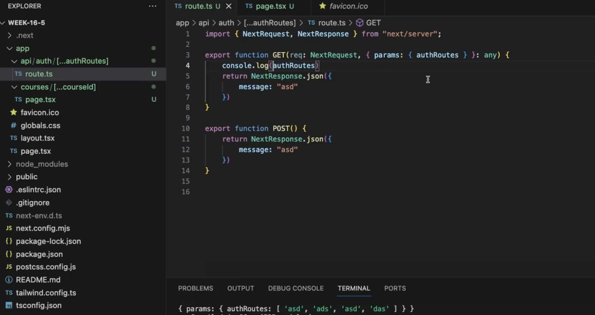
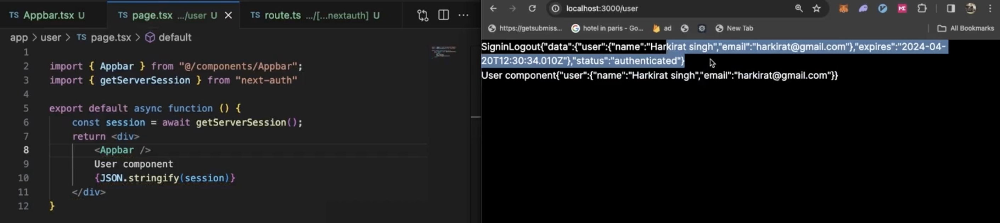
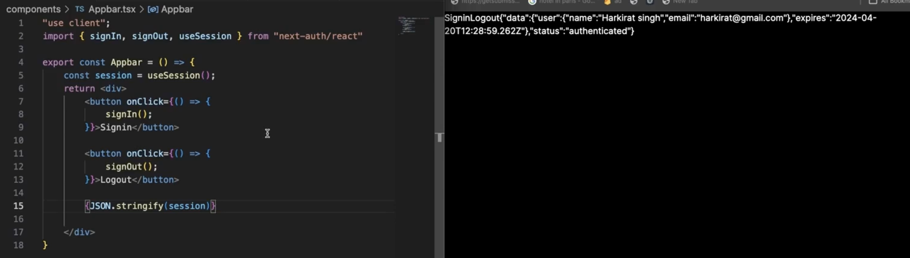

## Auth Using Cookies

- We have to use cookies for authentication with nextJS as we can't do it with JWT + local storage bcz a rendered page comes from the server.
- You can use `bcrypt` to hash the passwords
- If you want to get the user specific data in the very first request then we have to use cookies.
- Browsers by default send cookies with each request.
- Cookies can be transmitted but can't be accessed through the client side scripts.
- We can use a cookie in two websites for authentication
  
- Samesite can have three property:
  - None: cookie can be used from any website. It doesn't stop the CSRF (Cross Site Request Forgery) attacks. Eg. theme cookie. Never ever put authentication cookie here.
  - strict: only specific website is allowed, problem with strict-it will also block the cookie transfer even if you are accessing your website from the top level domain of other website
  - lax: it is in-between of none and strict, it will allow cookies to be send if it is get request for your website from top level domains
  - By default browser assumes the samesite to be lax.
- NextJS app can send cookie to other frontend app or backend app depending on use case.
  
- "cookie-parser": parses a very long cookie string and gets you an object. Cookie is a very long string separated by a semi-colon.
- In frontend from server you get cookie in set-cookie header.
- clearing a cookie:
  
- for cookies getting from frontend we have to do this in cors
  
- If the frontend and backend are not hosted on same website then you have to do this
  

## Next Auth

- Library for authentication doing in NextJs
- The below way any request which will come to api/auth/... will be handled by the route.ts this is known as all catch handler
  
- Extract the route from the URI
  
- catch all handlers are required for Next Auth
- Next auth gives three kind of providers:
  - OAuth
  - Email
  - Credentials (use anything even metamask(new way of authentication))
- You can extend the credentials providers to anything which is really powerful.
- Getting session details in server side
  
- Getting session details on client side. To get this session object you have to wrap the component with SessionProvider
  
- You can use signIn callback if you want to block certain kind of users to access (after signin before letting user to know they have signedIn). To get the userId on the server side session just pass the NEXT_AUTH obj to the getServerSession().
