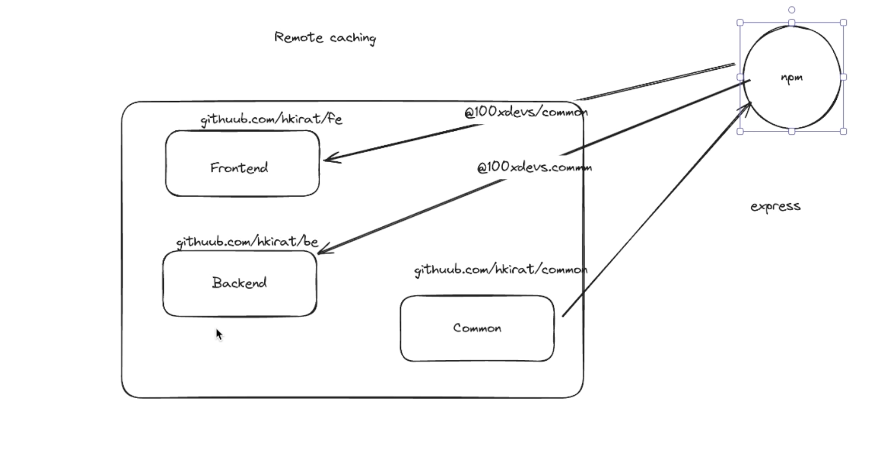
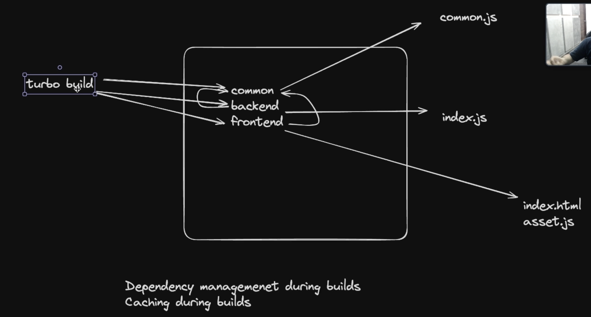

## Monorepos

### Introduction

- Mono + Repo = A single repository that holds all your frontend, backend, and devops code.
- Monorepos make sense if you have some sort of code sharing that is happening.
- If we didn't have monorepo
  
- Monorepo framework Eg. Lerna, nx, yarn/npm workspaces, Turborepo (not exactly a monorepo framework)
  
- Build System Orchestration
  
- Turborepo caches output and our net build time goes down
  
- packages folder contains helper modules which can be imported directly rather than importing as a node module.
- Turborepo is something which gives you remote caching, even if no change happened in the backend rebuild happens, whiich makes deplouyment slower. through this service they are thinking to earn money
  
- `tsup/esbuild`
- 
- 
