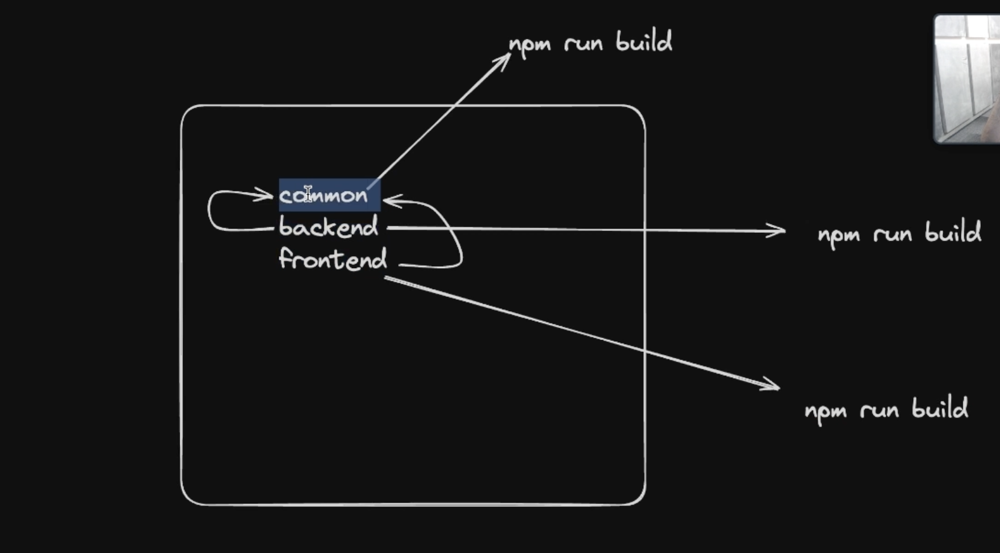
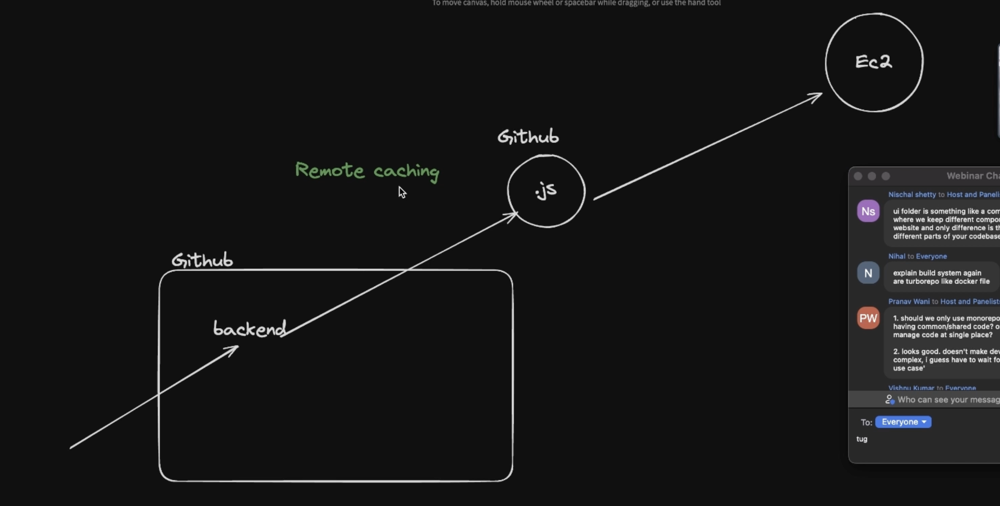
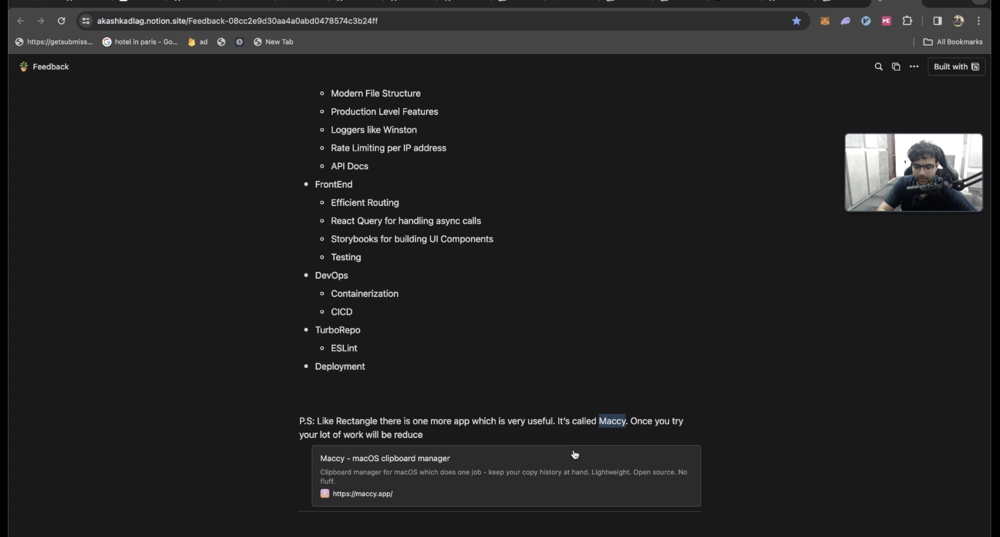

## Monorepos

### Introduction

- Mono + Repo = A single repository that holds all your frontend, backend, and devops code.
- Monorepos make sense if you have some sort of code sharing that is happening.
- If we didn't have monorepo
  
- Monorepo framework Eg. Lerna, nx, yarn/npm workspaces, Turborepo (not exactly a monorepo framework)
  
- Build System Orchestration
  
- Turborepo caches output and our net build time goes down
  
- packages folder contains helper modules which can be imported directly rather than importing as a node module.
- Turborepo is something which gives you remote caching, even if no change happened in the backend rebuild happens, whiich makes deplouyment slower. through this service they are thinking to earn money
  
- `tsup/esbuild`
- 
- 

### Turbo Generators

- Using them they help you to bootstrap new component, every time you don't have to go and add your new component in package.json
  - `npm run generate:component`
- The beauty of packages is that you define it once and you use it at multiple frameworks (be it next, react, cloudflare workers, express)

### turbo.json

- Turborepo is a build orchestrator
- Sample of turbo.json
  
- The build key indicate that turbo will go in each apps and packages and will run the build command and only after that the all apps will run depending on the dependency graph
  
- outputs is really important when it comes for caching.
- `dev: persistent` ensures that no other process is dependent on the apps running cuz they are in development and if this check is on it will throw error.
  

### Packages

- you can see the package is added into the dependencies
  
- here we have a global node modules folder rather than specific apps have their own node modules
- When multiple apps use the same package it comes into the global node-modules folder, that is why you didn't had to put explicitly the package name in the dependency
  
- convention for package name : @org/package_name
- Don't generate a new ts.config use the packages to create one
  
- give a look at slido.com/: online doubt asking platform
- esbuild also converts the ts to js
- sometimes tsc give error so use tsup
