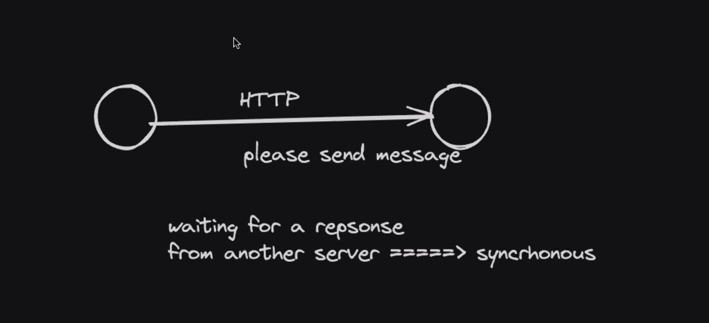
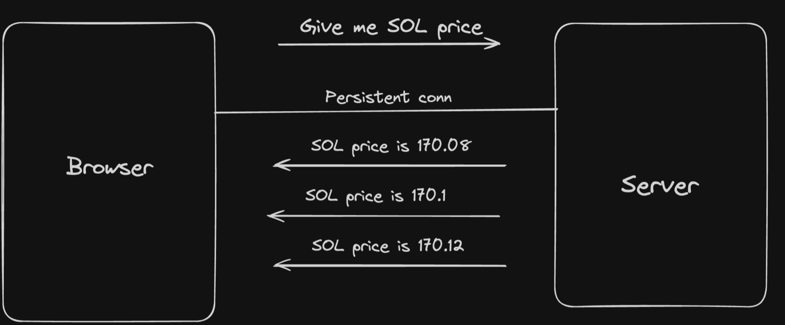
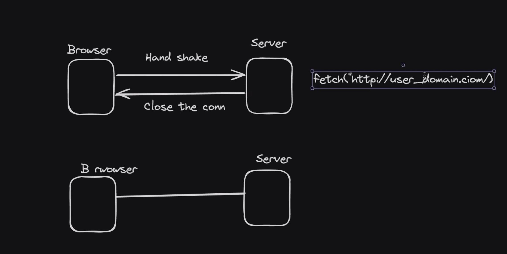
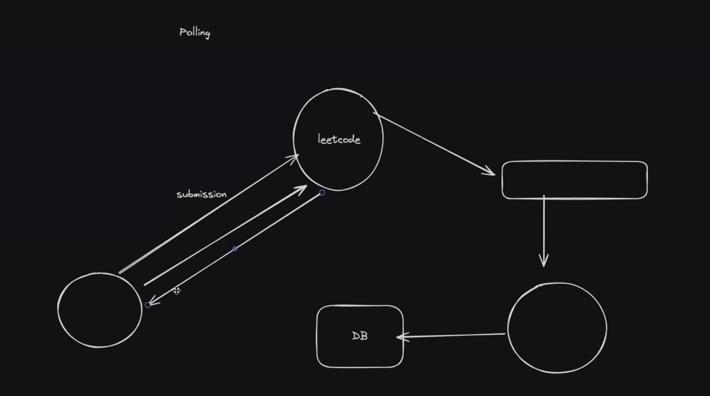
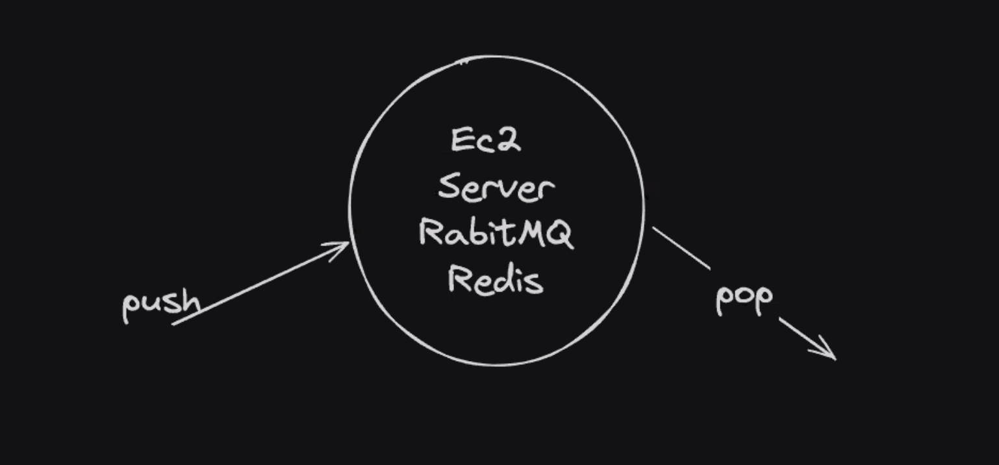
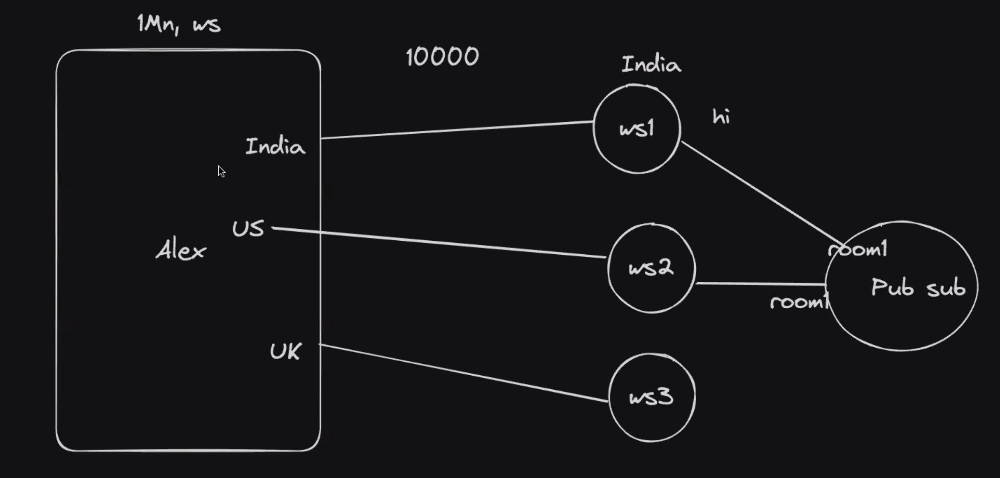

## Backend Communication

- pub sub (Publisher Subscriber) system

### Types of Communication

- Synchronous Communication
  - When one system is directly talking to other system
    
  - Eg.HTTP, Websocket
- Asynchronous Communication
  - When one system doesn't directly talk with other system or doesn't wait for the response
  - Eg.Messaging queues, Pub subs, Server-send events

### Websockets

- It is mostly used to browsers to talk to server, rarely used to servers talk to each other
  
- It is a persistent connection
  
- It is a full-duplex connection, here the server can find the browser and send event to browsers.
- Practical use case of websocket, crypto exchange, replit, leetcode.
- In websocket hand shake happens only once, then the communication keeps on happening. In HTTP we have 3 way hand shake.
- Another way is do pooling, we do continuously send the request to the server and ask for success/ fail. Types of Pooling: 1. short pooling, 2. long pooling
  
- koa, hono is another http framework
  
- Just like http fetch we also have websocket
- Look about HTTP pipelining.
- A client can persistently talk to each other using quic, webRTC.
- Android, browsers, different platform have there own websocket client.
- Eg. socket.io (problem with this is harder to support multiple platform)
  
- The first request which goes for websocket is just a http request, the only thing happens at the server level is the request gets updrage to websocket request on server, websocket server is a http server.
- Have a look at https://hoppscotch.io/
- Just like the fetch api for http we have websocket api.

### Scaling WS

- Sticky Connection: Sharding the connection means you will connect a server doesn't belong from where you are connecting. In sticky connection all the connection for a room connects to a single web socket server.
- Non-Sticky connection
  
