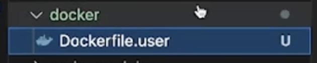

# CI/ CD Pipeline

## Introduction

- CI/ CD is general concept, it can be done in github, gitlab, aws, etc.

## CI

- Your workflows is inside the .github/workflows/lint.yml
- Checking out repository means cloning your repo

## CD

### DockerFile

- Create docker image for each app you have
  
- Build your docker image from the Dockerfile
  `docker build -t mynextapp -f docker/Dockerfile.user •`

### EC2

- 
- `sudo docker run -e DATABASE_URL $(< SECRETS.DB_URL 3-restart--d --name web-app -p 3005:3000 100xdevs/week-18-cla`
- Elastic beanstalk: gives you easy deployment and scaling
- Then try to deploy on:
  - ECR = Elastic container registry
  - ECS = Elastic container service
- IIAC look for this
